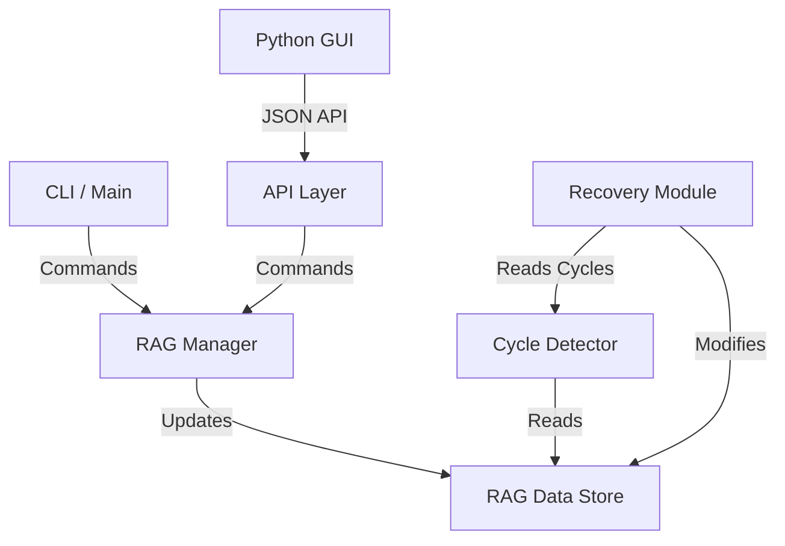

# System Architecture

## Core Concept: Resource Allocation Graph (RAG)
The heart of the OS-EL Deadlock Module is the **Resource Allocation Graph (RAG)**. This is a directed graph used to model the state of the system in terms of resources and processes.

### Nodes
The graph consists of two types of nodes (`NodeType` in `rag.h`):
1.  **Process Nodes (`NODE_PROCESS`)**: Represent active processes in the system.
    -   *Attributes*: `id`, `name`, `priority`, `state` (RUNNING, WAITING, BLOCKED).
    -   *Structure*: `Process` struct in `rag.h`.
2.  **Resource Nodes (`NODE_RESOURCE`)**: Represent system resources (CPU, Disk, Mutex, etc.).
    -   *Attributes*: `id`, `name`, `total_instances`, `available_instances`.
    -   *Structure*: `Resource` struct in `rag.h`.

### Edges
Interactions are modeled as directed edges (`EdgeType` in `rag.h`):
1.  **Request Edge (`EDGE_REQUEST`)**: Directed from **Process -> Resource**.
    -   *Meaning*: Process $P_i$ is requesting an instance of Resource $R_j$.
    -   *Representation*: `request_matrix[P][R] = 1`.
2.  **Assignment Edge (`EDGE_ASSIGNMENT`)**: Directed from **Resource -> Process**.
    -   *Meaning*: An instance of Resource $R_j$ is allocated to Process $P_i$.
    -   *Representation*: `assignment_matrix[P][R] = N` (where N is instances held).

## Data Structures

### The `RAG` Structure
Thinking globally, the `RAG` struct holds the entire state:
```c
typedef struct {
    Process processes[MAX_PROCESSES];
    Resource resources[MAX_RESOURCES];
    
    // Adjacency Matrices for fast O(1) lookups
    int request_matrix[MAX_PROCESSES][MAX_RESOURCES];
    int assignment_matrix[MAX_PROCESSES][MAX_RESOURCES];
    
    int process_count;
    int resource_count;
} RAG;
```

### Design Decisions
1.  **Static Allocation**: The system uses fixed-size arrays (`MAX_PROCESSES`, `MAX_RESOURCES`) to avoid complex memory management during educational simulations and to ensure deterministic behavior.
2.  **Adjacency Matrices**: Matrices are used instead of adjacency lists. While this uses $O(N \times M)$ memory, it allows for $O(1)$ verification of requests and allocations, which is critical for the frequent deadlock detection checks.
3.  **Separation of Concerns**:
    -   `rag.c`: Manages the graph state (CRUD operations).
    -   `cycle_detector.c`: Pure logic for analyzing the graph (Read-only on RAG).
    -   `recovery.c`: Logic for modifying the graph to resolve issues.

## Component Interaction

